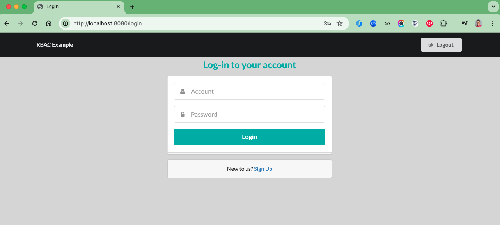
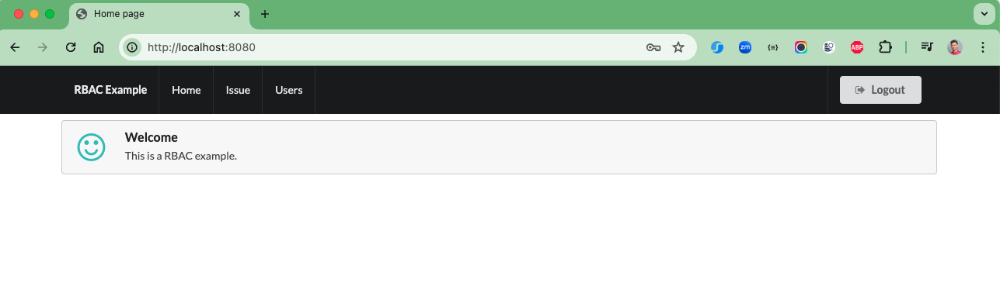
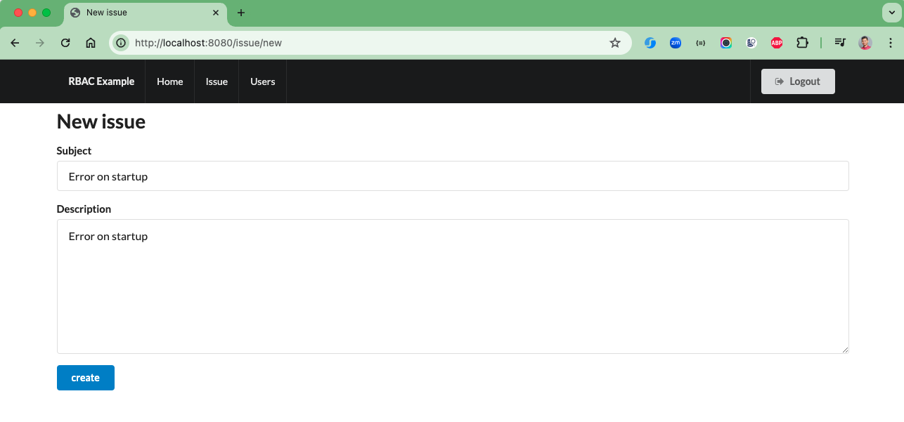
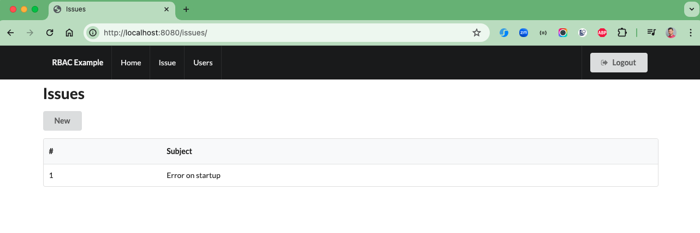
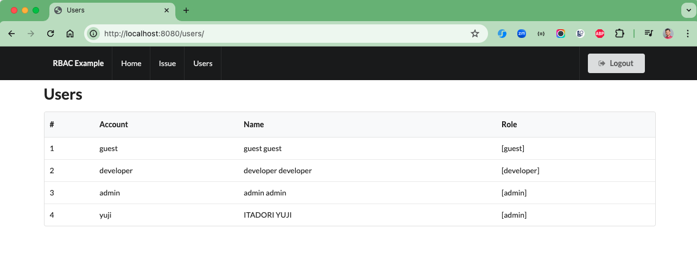

# RBAC example

This application is an example of role based access control using Spring Security, Spring MVC and Thymeleaf.

Original(Ninja Framework) : https://github.com/kawasima/rbac-example by @kawasima

@kawasima's blog(Japanese) -> https://qiita.com/kawasima/items/8dd7eda743f2fdcad78e

## Get started

```bash
$ mvn clean spring-boot:run
```

or

```bash
$ mvn clean package
$ java -jar target/rbac-example-springsecurity-1.0.jar
```

### Credentials Account

| # | Username  | Password  |
|---|-----------|-----------|
| 1 | admin     | admin     |
| 2 | developer | developer |
| 3 | guest     | guest     |

### Image Screenshots

Login page



Home Page



Add Issue



List Issues



List Users


